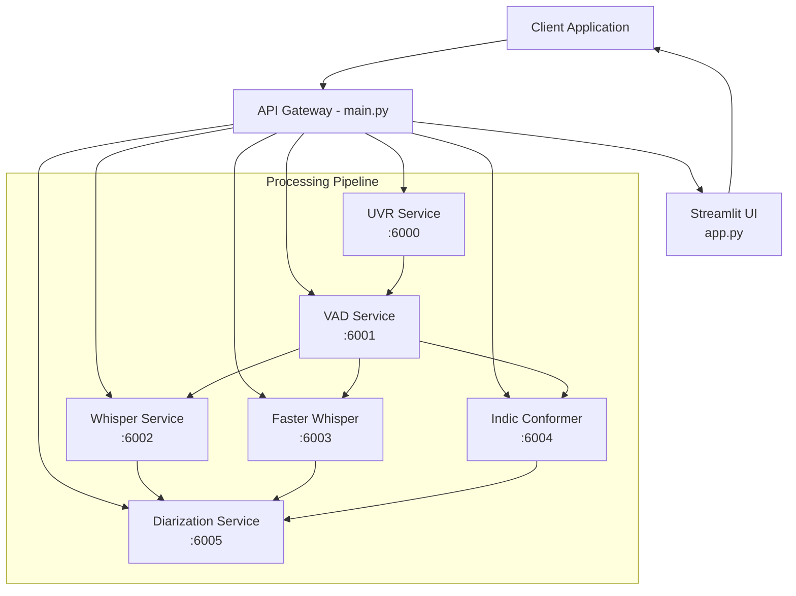

# 🎙️ TransVox - Advanced Speech-to-Text Pipeline

<div align="center">


**A production-ready, microservices-based speech transcription pipeline with advanced audio processing capabilities**

[Features](#-features) • [Architecture](#-architecture) • [Installation](#-installation) • [Quick Start](#-quick-start)

</div>

---

## 📋 Table of Contents

- [Overview](#-overview)
- [Features](#-features)
- [Architecture](#-architecture)
- [Services](#-services)
- [Installation](#-installation)
- [Configuration](#-configuration)
- [Usage](#-usage)
- [Development](#-development)
- [Support](#-support)

## 🎯 Overview

TransVox is a comprehensive, enterprise-grade speech-to-text solution that combines multiple cutting-edge AI services into a unified transcription pipeline. Built with a microservices architecture, it offers unparalleled flexibility, scalability, and accuracy for all your audio transcription needs.

### Key Capabilities

- **Multi-Engine Support**: Choose from Whisper, Faster Whisper, or Indic Conformer based on your requirements
- **Advanced Audio Processing**: Vocal removal, voice activity detection, and speaker diarization
- **Language Support**: Extensive multilingual capabilities including Indian languages
- **Flexible Deployment**: Microservices architecture allows for distributed, scalable deployment
- **User-Friendly Interface**: Professional Streamlit web application with session management

## ✨ Features

### Core Features

- 🎵 **Universal Vocal Remover (UVR)** - Isolate speech from background music and noise
- 🗣️ **Voice Activity Detection (VAD)** - Identify and segment speech regions
- 🎯 **Speaker Diarization** - Identify and label different speakers
- 🌍 **Multi-Language Support** - English, Spanish, French, German, Chinese, Japanese, Hindi, and more
- 📊 **Multiple Output Formats** - SRT, TXT
- 🔄 **Real-time Processing** - Stream processing capabilities for live audio
- 📱 **Session Management** - User-specific sessions with request tracking

### Technical Features

- **RESTful API** with comprehensive documentation
- **Microservices Architecture** for scalability
- **Asynchronous Processing** for improved performance
- **Comprehensive Logging** with structured JSON logs
- **Error Handling** with detailed error messages
- **Request Tracking** with unique request IDs

## 🏗️ Architecture

TransVox employs a microservices architecture where each service handles a specific aspect of the audio processing pipeline:



## 🔧 Services

### Main Orchestration Service
- **Port**: 9001
- **Description**: Central API gateway that orchestrates all microservices
- **Endpoint**: `/speech-to-text-service`

### Audio Processing Services

| Service | Port | Description | Technology |
|---------|------|-------------|------------|
| **UVR Service** | 6000 | Removes background music and noise | MDX-Net, Demucs |
| **VAD Service** | 6001 | Detects voice activity regions | Silero VAD |
| **Whisper Service** | 6002 | OpenAI's Whisper transcription | OpenAI Whisper |
| **Faster Whisper** | 6003 | Optimized Whisper implementation | CTranslate2 |
| **Indic Conformer** | 6004 | Indian language transcription | AI4Bharat |
| **Diarization Service** | 6005 | Speaker identification and labeling | Pyannote |

## 📦 Installation

### Prerequisites

- Python 3.10 or higher
- CUDA 11.7+ (for GPU acceleration)
- FFmpeg
- 16GB+ RAM (recommended)
- 50GB+ free disk space

### System Dependencies

```bash
# Ubuntu/Debian
sudo apt-get update
sudo apt-get install -y ffmpeg python3-pip python3-dev build-essential

# macOS
brew install ffmpeg python@3.10

# Windows
# Install FFmpeg from https://ffmpeg.org/download.html
# Install Python from https://www.python.org/downloads/
```

### Clone Repository

```bash
git clone https://github.com/himanshumahajan138/transvox.git
cd transvox
```

### Install Dependencies

#### Option 1: Install All Services

```bash
# Install main dependencies
pip install -r requirements.txt

# Install service-specific dependencies
for service in asr_service/*/requirements.txt diarization_service/requirements.txt uvr_service/requirements.txt vad_service/requirements.txt; do
    pip install -r $service
done
```

#### Option 2: Install Specific Services

```bash
# Main service (required)
pip install -r requirements.txt

# Choose specific services
pip install -r uvr_service/requirements.txt           # For UVR
pip install -r vad_service/requirements.txt           # For VAD
pip install -r asr_service/whisper_service/requirements.txt  # For Whisper
# ... and so on
```

### Download Models

```bash
# Download required models
python scripts/download_models.py

# Or manually download specific models
python -c "import whisper; whisper.load_model('base')"
```

## ⚙️ Configuration

### Environment Variables

Create a `.env` file in the root directory:

```env

# API_KEY
HF_TOKEN=your Hugging Face Tooken

# Service URLs
UVR_URL=http://0.0.0.0:6000/uvr
VAD_URL=http://0.0.0.0:6001/vad
WHISPER_URL=http://0.0.0.0:6002/transcribe
FASTER_WHISPER_URL=http://0.0.0.0:6003/transcribe
INDIC_CONFORMER_URL=http://0.0.0.0:6004/transcribe
DIARIZE_URL=http://0.0.0.0:6005/diarize

# API Configuration
API_HOST=0.0.0.0
API_PORT=9001
DEBUG=False

# Model Configuration
WHISPER_MODEL=base
DEVICE=cuda  # or cpu
BATCH_SIZE=16

# Logging
LOG_LEVEL=INFO
LOG_FILE=logs/stt-service.log
```

### Service Configuration

Each service can be configured individually through their respective configuration files or environment variables.

## 🚀 Usage

### Starting the Services

```bash
# Terminal 1 - UVR Service
cd uvr_service
python uvr_api.py

# Terminal 2 - VAD Service
cd vad_service
python vad_api.py

# Terminal 3 - Whisper Service
cd asr_service/whisper_service
python whisper_api.py

# Terminal 4 - Diarization Service
cd diarization_service
python diarize_api.py

# Terminal 5 - Main API
python main.py

# Terminal 6 - Streamlit UI
streamlit run app.py
```

## 📚 API Documentation

### Main API Endpoint

#### POST `/speech-to-text-service`

Processes audio through the complete transcription pipeline.

**Request Body:**

```json
{
  "audio_url": "https://example.com/audio.mp3",
  "audio_path": "/path/to/audio.mp3",
  "stt_service": "whisper",
  "language": "english",
  "wlt": true,
  "uvr": true,
  "vad": true,
  "diarize": false,
  "output_format": "json",
  "req_id": "user1_20241114_123456",
  "maintain_gaps": true,
  "start_pattern": "[{",
  "end_pattern": "}]: "
}
```

**Response:**

```json
{
  "status": "success",
  "req_id": "user1_20241114_123456",
  "output_file_path": "/outputs/transcription_123456.json",
  "transcript": "Full transcription text here...",
  "segments": [
    {
      "start": 0.0,
      "end": 5.2,
      "text": "Segment text",
      "speaker": "SPEAKER_01"
    }
  ],
  "original_speakers": ["SPEAKER_01", "SPEAKER_02"]
}
```

### Service-Specific Endpoints

#### UVR Service
- **POST** `/uvr` - Remove vocals from audio

#### VAD Service
- **POST** `/vad` - Detect voice activity

#### Whisper Services
- **POST** `/transcribe` - Transcribe audio

#### Diarization Service
- **POST** `/diarize` - Perform speaker diarization


## 🎨 Streamlit Interface

Access the web interface at `http://localhost:8501`

### Features:
- User authentication with session management
- Audio file upload or URL input
- Real-time transcription progress
- Download transcripts in multiple formats
- Request history tracking
- User-specific sessions

### Default Credentials:
- Username: `demo` | Password: `demo`

## 🔬 Development

### Project Structure

```
TransVox/
├── app.py                    # Streamlit web interface
├── main.py                   # Main API orchestrator
├── utils.py                  # Shared utilities
├── logger_utils.py           # Logging configuration
├── requirements.txt          # Main dependencies
├── asr_service/             # ASR microservices
│   ├── whisper_service/
│   ├── faster_whisper_service/
│   └── indic_conformer_service/
├── diarization_service/     # Speaker diarization
├── uvr_service/            # Vocal removal
├── vad_service/            # Voice activity detection
├── logs/                   # Application logs
├── scripts/               # Utility scripts
└── tests/                # Test suites
```

### Adding New Services

1. Create service directory structure:
```bash
mkdir -p new_service
touch new_service/{api.py,requirements.txt,logger_utils.py}
```

2. Implement service API following the pattern
3. Update `utils.py` to integrate the service
4. Add service URL to configuration


### Performance Optimization

- **GPU Acceleration**: Ensure CUDA is properly configured
- **Batch Processing**: Adjust batch sizes based on available memory
- **Caching**: Implement Redis for caching frequent requests
- **Load Balancing**: Use nginx or HAProxy for distributing load

### Development Workflow

1. Fork the repository
2. Create your feature branch (`git checkout -b feature/AmazingFeature`)
3. Commit your changes (`git commit -m 'Add some AmazingFeature'`)
4. Push to the branch (`git push origin feature/AmazingFeature`)
5. Open a Pull Request

### Contribution Areas

- 🐛 Bug fixes
- ✨ New features
- 📚 Documentation improvements
- 🧪 Test coverage
- 🎨 UI/UX enhancements
- 🌍 Language support

## 📄 License

This project is licensed under the MIT License - see the [LICENSE](LICENSE) file for details.


### Community

- 📧 Email: himanshumahajan138@gmail.com

## 🙏 Acknowledgments

- OpenAI for Whisper
- AI4Bharat for Indic language models
- Pyannote for speaker diarization
- The open-source community

## 📊 Performance Benchmarks

| Model | Language | WER | Speed (RTF) | Memory |
|-------|----------|-----|-------------|---------|
| Whisper Base | English | 5.2% | 0.15x | 1.5GB |
| Faster Whisper | English | 5.0% | 0.08x | 1.2GB |
| Indic Conformer | Hindi | 8.1% | 0.12x | 2.0GB |

---

<div align="center">

**Built with ❤️ by the Himanshu**

[Report Bug](https://github.com/yourusername/transvox/issues) • [Request Feature](https://github.com/yourusername/transvox/issues)

</div>